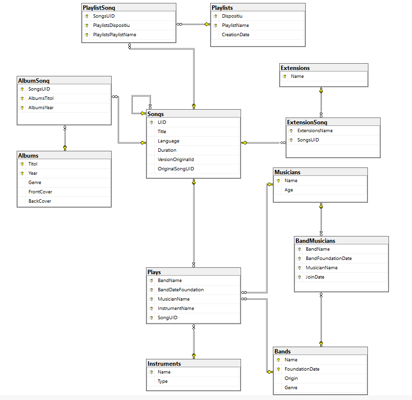

# Canvis API SQL

## Descripció
Modificacions necessàries per actualitzar el projecte segons el nou model ER:

## Canvis
### Classe Album
S'han afegit 3 atributs: imatge portada (FrontCover), imatge contraportada (BackCover) i gènere (Genre).

### Classe Band
Nou atribut any fundació (FoundationDate) que forma part de la clau primària juntament amb nom (Name). 

### Relació Band Musician
Hem creat una classe nova BandMusician. Era una taula es generava sola per relacionar les entitats Band i Musician, però com que volem afegir-hi un atribut data (JoinDate) l'hem de crear nosaltres per especificar aquest atribut.

## Diagrama Base de Dades Final
